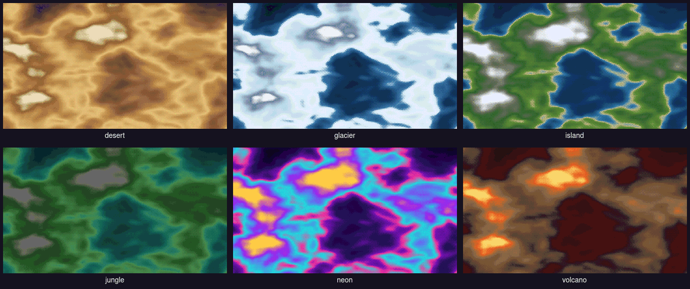
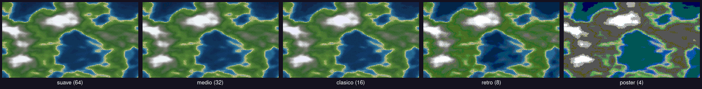
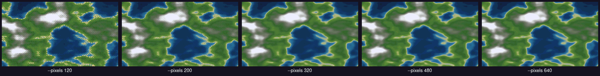
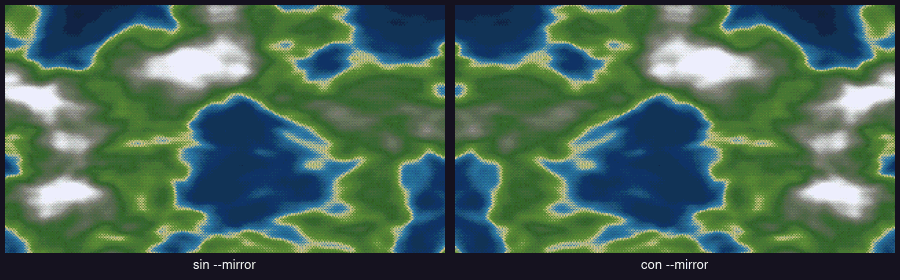
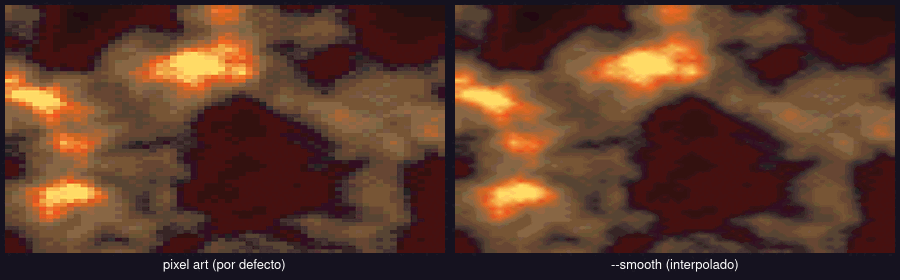
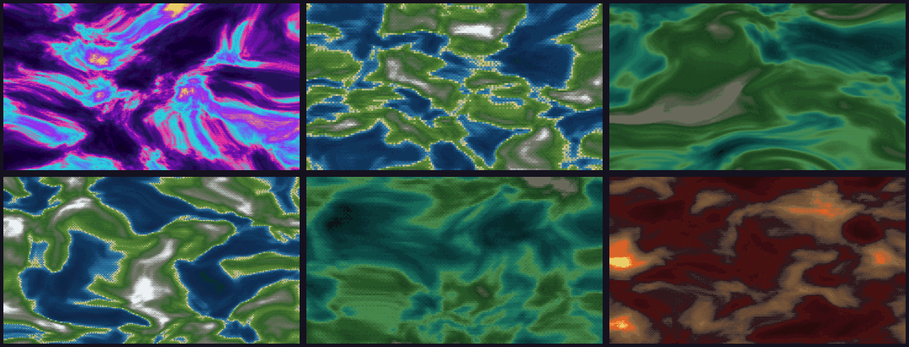

# RazorWall

```
:::::::..    :::.     :::::::::    ...    :::::::..
;;;;``;;;;   ;;`;;    '`````;;; .;;;;;;;. ;;;;``;;;;
 [[[,/[[['  ,[[ '[[,      .n[[',[[     \[[,[[[,/[[['
 $$$$$$c   c$$$cc$$$c   ,$$P"  $$$,     $$$$$$$$$c
 888b "88bo,888   888,,888bo,_ "888,_ _,88P888b "88bo,
 MMMM   "W" YMM   ""`  `""*UMM   "YMMMMMP" MMMM   "W"
```

**Generador de wallpapers pixel art con ruido Perlin.**

Un fondo distinto cada día, derivado de la fecha, para que el escritorio nunca
se repita. Si te gusta alguno, siempre puedes volver a generarlo.

Sin dependencias: un solo archivo de Go, un solo binario. No necesita Python,
ni ImageMagick, ni nada fuera de la stdlib.


---

## Índice

- [Instalación](#instalación)
- [Uso rápido](#uso-rápido)
- [Todas las opciones](#todas-las-opciones)
- [Catálogo visual](#catálogo-visual)
  - [Temas](#temas)
  - [Niveles de color](#niveles-de-color)
  - [Resolución de la rejilla](#resolución-de-la-rejilla)
  - [Simetría](#simetría)
  - [Pixel art vs. interpolado](#pixel-art-vs-interpolado)
  - [Modo aleatorio](#modo-aleatorio)
- [Cómo funciona](#cómo-funciona)
- [Detalles técnicos](#detalles-técnicos)

---

## Instalación

Necesitas Go 1.21 o superior.

```bash
git clone <url-del-repo>
cd Razor
go build -ldflags="-s -w" -o razorwall razorwall.go
```

Eso genera un binario de unos 2 MB. También funciona sin compilar:

```bash
go run razorwall.go --theme volcano
```

## Uso rápido

Ejecutado sin argumentos, `razorwall` **muestra la documentación y no genera
nada**. En cuanto le pasas algo, dibuja el fondo y lo guarda.

```bash
./razorwall                        # imprime la ayuda
./razorwall --theme neon           # el fondo de hoy en tema neón
./razorwall --random --preview     # algo distinto cada vez, visto en la terminal
./razorwall --gallery 8            # ocho variaciones para elegir
```

El PNG se escribe **junto al binario**, con el nombre de la fecha
(`2026-09-30.png`), sin importar desde qué directorio lo ejecutes. Con
`--dir` o `--out` decides tú dónde va.

## Todas las opciones

| Opción | Qué hace |
| --- | --- |
| `-t`, `--theme` | Tema de color: `island`, `volcano`, `desert`, `glacier`, `jungle`, `neon`, o `random` |
| `-x`, `--pixels` | Ancho de la rejilla pixelada. Cuanto menor, bloques más grandes (por defecto `320`) |
| `--levels` | Tonos por canal: `suave` 64, `medio` 32, `clasico` 16, `retro` 8, `poster` 4 |
| `--size` | Tamaño final de la imagen, p. ej. `2560x1440` (por defecto `1920x1080`) |
| `--quality` | Atajo de resolución: `fast` 1280x720, `normal` 1920x1080, `high` 2560x1440 |
| `--mirror` | Refleja el terreno en horizontal |
| `-p`, `--preview` | Dibuja también el resultado en la terminal, a color |
| `-r`, `--random` | Surprise me: tira tema, niveles, rejilla y resolución |
| `-N`, `--seed` | Semilla manual (por defecto, la fecha del día) |
| `--date` | Simula otra fecha: `--date 2026-01-15` |
| `--yesterday` / `--tomorrow` | El fondo del día anterior o del siguiente |
| `-o`, `--out` | Ruta exacta del archivo de salida |
| `-d`, `--dir` | Carpeta de salida (por defecto, la del propio binario) |
| `--format` | `png` (por defecto) o `jpg` |
| `--smooth` | Escala con interpolación en vez de vecino más cercano |
| `-g`, `--gallery` | Genera N variaciones en una subcarpeta `gallery` |
| `-l`, `--list` | Lista estilos, temas y niveles |
| `--version` | Muestra la versión |

Se aceptan tanto `--theme volcano` como `--theme=volcano`.

### Ejemplos

```bash
# Clásico de cada día, tema cálido y bien saturado
./razorwall --theme volcano --levels retro

# Sorpresa: tema, tamaño, rejilla y resolución al azar, y se ve en la terminal
./razorwall --random --preview

# Un fondo concreto y reproducible
./razorwall --seed 42 --theme island --pixels 480

# Composición simétrica, muy grande
./razorwall --mirror --quality high --out /tmp/paisaje.png

# Ocho candidatos para elegir el mejor
./razorwall --gallery 8
```

### El detalle de `--random`

Las opciones explícitas **ganan** sobre el azar. Si escribes
`--random --theme neon`, te da tema neón fijo y tirado el resto.
El nombre del archivo incluye lo que salió, para que las tiradas no se
pisen entre sí:

```
2026-09-30-neon-320-retro-ffih.png
          │    │   │     │    └─ semilla
          │    │   │     └────── niveles
          │    │   └──────────── rejilla
          │    └──────────────── tema
          └───────────────────── fecha
```

## Catálogo visual

Todo lo de abajo está generado con el mismo seed (`20260930`) para que
puedas comparar de verdad.

### Temas

Cada tema define su propia rampa de bioma, de abismo a cumbre.



| Tema | Descripción |
| --- | --- |
| `island` | Océanos profundos, playas yierra alta nevada |
| `volcano` | Basalto, roca volcánica y lava incandescente |
| `desert` | Dunas y cañones áridos, sin agua |
| `glacier` | Mar abierto, hielo y roca desnuda |
| `jungle` | Selva densa y riscos entre la vegetación |
| `neon` | Interpolación synthwave entre cian, magenta y ámbar |

Si no indicas `--theme`, el tema rota a diario pasando por los seis, y nunca
repite el del día anterior:

```
2026-09-28  neon
2026-09-29  island
2026-09-30  volcano
2026-10-01  desert
2026-10-02  glacier
2026-10-03  jungle
2026-10-04  neon
```

### Niveles de color

Cuántos tonos distintos se usan por canal. Degradado a más tonos es casi
continuo; a menos tonos, cada zona se lee como un plano de color puro.



| Nivel | Tonos/canal | Para qué |
| --- | --- | --- |
| `suave` | 64 | Apenas sugiere el pixel art, mucho matiz |
| `medio` | 32 | Intermedio, con transiciones visibles |
| `clasico` | 16 | El equilibrio habitual (por defecto) |
| `retro` | 8 | Paleta muy marcada, aspecto de game boy |
| `poster` | 4 | Serigrafía, un solo plano por zona |

### Resolución de la rejilla

`--pixels` define el ancho de la rejilla sobre la que se calcula el ruido.
Es el tamaño del "ladrillo" del pixel art: la rejilla se escala después al
tamaño final con vecino más cercano, así que **cada celda se convierte en un
bloque nítido**.



| Valor | Blocks aprox. en 1920px | Efecto |
| --- | --- | --- |
| `120` | 16 px | Muy grueso, casi mosaico |
| `200` | 10 px | Aspecto de Game Boy |
| `320` | 6 px | Equilibrado (por defecto) |
| `480` | 4 px | Detalle medio |
| `640` | 3 px | Casi imagen normal, pero sin perder el bloque |

Valores más altos dan más detalle del terreno pero menos coarseness de pixel.
El tiempo de render es prácticamente el mismo en todos los casos porque el
cálculo ocurre en la rejilla pequeña.

### Simetría

`--mirror` refleja el terreno en el eje vertical. Queda más equilibrado como
fondo de pantalla que el ruido puro, y útil si vas a poner iconos encima.



### Pixel art vs. interpolado

Por defecto se escala con vecino más cercano (`Point`), que es lo que produce
los bloques duros. Con `--smooth` se usa interpolación bilineal y el resultado
se ve como una imagen normal, sin carácter pixel art.



> Para que la diferencia se note, la rejilla de estas dos imágenes es de 40 píxeles.

### Modo aleatorio

`--random` tira tema, niveles, rejilla y resolución, y usa entropía real del
sistema en vez de la fecha, así que cada llamada da algo distinto.



## Cómo funciona

1. **La fecha es la semilla.** `2026-09-30` se convierte en el número
   `20260930`. Mismo día, mismo fondo, siempre. Y cualquier día pasado se
   puede regenerar con `--date`.

2. **Campo de altura con Perlin.** Se suman 4 a 7 octavas de ruido Perlin
   clásico (gradientes aleatorios, no el de valor), con curva de suavizado
   quintica. Se le aplica *domain warping*, que desplaza las coordenadas de
   muestreo con otro ruido: así las costas se curvan y no salen círculos
   ni manchas.

3. **Bandas de bioma.** La altura se corta en franjas (abismo, mar, bajío,
   playa, campo, bosque, roca, cumbre) según la rampa del tema, con
   interpolación entre colores.

4. **Dithering ordenado.** Una matriz de Bayer 4x4 rompe los bordes rectos
   entre bandas sin introducir ruido aleatorio, así que el resultado sigue
   siendo reproducible.

5. **Cuantización.** El color se reduce a N tonos por canal. Esto es lo que
   produce el aspecto pixel art.

6. **Escalado.** La rejilla (320x180 por defecto) se amplía al tamaño final.

### El `--preview` en la terminal

Con `--preview` el fondo se dibuja en el terminal usando bloques medios
(`▀`) en color de 24 bits. Cada carácter representa dos píxeles verticales:
el de arriba en primer plano, el de abajo en segundo plano.

```
▀▀▀▀▀▀▀▀▀▀▀▀▀▀▀▀▀▀▀▀▀▀▀▀▀▀▀▀▀▀▀▀▀▀▀▀▀▀▀▀▀▀▀▀▀▀▀▀▀▀▀▀▀▀▀▀▀▀▀
▀▀▀▀▀▀▀▀▀▀▀▀▀▀▀▀▀▀▀▀▀▀▀▀▀▀▀▀▀▀▀▀▀▀▀▀▀▀▀▀▀▀▀▀▀▀▀▀▀▀▀▀▀▀▀▀▀▀▀
▀▀▀▀▀▀▀▀▀▀▀▀▀▀▀▀▀▀▀▀▀▀▀▀▀▀▀▀▀▀▀▀▀▀▀▀▀▀▀▀▀▀▀▀▀▀▀▀▀▀▀▀▀▀▀▀▀▀▀
▀▀▀▀▀▀▀▀▀▀▀▀▀▀▀▀▀▀▀▀▀▀▀▀▀▀▀▀▀▀▀▀▀▀▀▀▀▀▀▀▀▀▀▀▀▀▀▀▀▀▀▀▀▀▀▀▀▀▀
▀▀▀▀▀▀▀▀▀▀▀▀▀▀▀▀▀▀▀▀▀▀▀▀▀▀▀▀▀▀▀▀▀▀▀▀▀▀▀▀▀▀▀▀▀▀▀▀▀▀▀▀▀▀▀▀▀▀▀
```

*(Bloques grises aquí: en un terminal de verdad cada uno lleva su color RGB.)*

## Detalles técnicos

- **Rendimiento**: unos 70 ms por imagen a 1920x1080, en un solo hilo. El
  trabajo pesado ocurre en la rejilla de 320x180 (57 600 píxeles), no en los
  2 millones del archivo final: por eso no hace falta paralelizar.
- **Sin dependencias**: solo `image/png` e `image/jpeg` de la stdlib. El
  PNG se escribe directamente, sin pasar por herramientas externas.
- **Determinismo**: misma semilla y mismas opciones producen un PNG idéntico
  byte a byte. Verificado con `cmp`.
- **El logo** del banner está incrustado como constante `logoLines` en el
  propio `.go`, así que el fuente es autónomo. Si lo cambias en `logo.txt`,
  actualiza esa constante.

### Un detalle sobre el ruido

Al principio los fondos salían con franjas verticales en vez de islas. La causa
era que, dentro del bucle que recorre cada fila, el desplazamiento del
*domain warping* se acumulaba sobre la variable `fy` en vez de aplicarse a una
copia local: para cuando llegaba al final de la fila, el offset ya se había
sumado 320 veces. El resultado era una tira vertical constante.

El comentario del código lo advierte, porque es muy fácil reintroducirlo:

```go
// El desplazamiento va a variables propias: aplicarlo sobre
// baseX/baseY los contaminaría para el resto de la fila y el
// ruido saldría a rayas verticales.
```